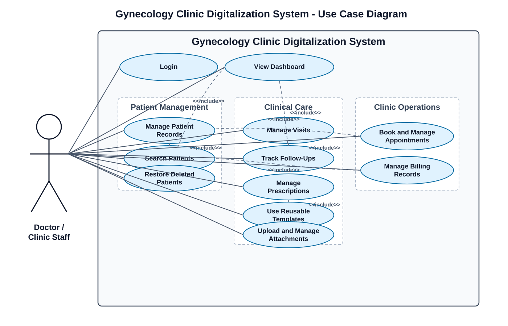

# 3. System Analysis

## 3.1 Requirements

### 3.1.1 Functional Requirements

The functional requirements define the main actions and services that the Clinic Digitalization System must provide to support the daily workflow of the gynecology clinic.

1. The system shall allow authorized users to create, view, update, manage, soft delete, and restore patient records.
2. The system shall store patient medical history digitally, including personal information, previous visits, prescriptions, attachments, and follow-up details.
3. The system shall provide quick patient search by key information such as name, phone number, and date of birth.
4. The system shall maintain a complete history of patient visits and display recent visits for quick access to active or ongoing cases.
5. The system shall support visit documentation with required fields to prevent incomplete submissions, including the current standard visit form and a pregnancy-status prompt.
6. The system shall support prescription creation and management, with prescriptions linked to the relevant patient visit.
7. The system shall allow uploading, downloading, and managing patient attachments such as laboratory results, ultrasound images, scanned documents, and medical reports.
8. The system shall provide reusable templates for medical cases, prescriptions, and laboratory tests to reduce repetitive clinical writing.
9. The system shall allow booking, tracking, and managing appointments, visits, and follow-ups.
10. The system shall support billing record management and store payment information linked to patients and, when relevant, visits.
11. The system shall display a dashboard with daily clinic statistics, summaries, recent activity, follow-ups, visit information, and billing totals.
12. The system shall authenticate users through a secure login system before allowing access to clinic data.

### 3.1.2 Non-Functional Requirements

The non-functional requirements describe the quality attributes the system must satisfy to remain practical, reliable, and suitable for clinical use.

1. The system shall protect sensitive patient information through secure authentication and controlled access.
2. The system shall provide a clear, organized, and user-friendly interface that supports efficient clinic workflow.
3. The system shall ensure reliable storage and retrieval of patient records, visits, prescriptions, attachments, and billing data.
4. The system shall reduce human error through structured forms, required fields, and validation mechanisms.
5. The system shall provide fast response times for searching, saving, updating, and retrieving clinic data.
6. The system shall be maintainable and scalable to support future features such as advanced analytics, pregnancy modules, stronger security, cloud deployment, and multi-doctor access.

## 3.2 System Architecture

### 3.2.1 Overall Architecture

The implemented system follows a three-layer web architecture composed of a React TypeScript frontend, a Laravel PHP backend API, and a MySQL relational database. The frontend is responsible for user interaction, page navigation, form handling, local interface validation, and API communication. The backend exposes HTTP API endpoints for the main clinic resources, handles database operations through Laravel models and controllers, and stores uploaded files through Laravel's public storage disk. The database layer stores structured clinic data such as users, patients, visits, prescriptions, appointments, attachments, billing records, and reusable templates.

This architecture separates the user interface from the business and persistence layers. As a result, the clinic user interacts with a browser-based application, while patient and clinic data are managed through API requests to the Laravel backend and persisted in MySQL. This structure is suitable for a clinic digitalization system because it supports modular development, clearer maintenance, and future deployment improvements such as cloud hosting or multi-user access.

### 3.2.2 Frontend Layer

The frontend is implemented in `clinic-companion` using React, TypeScript, Vite, React Router, TanStack Query, Tailwind CSS, and reusable UI components. Routing is defined in `App.tsx`, where protected pages include the dashboard, patients, patient profile, templates, appointments, and billing. The frontend uses an `AuthContext` to keep the logged-in user state and stores the user object and token in `localStorage`. The `ProtectedRoute` component prevents unauthenticated users from accessing the main pages at the client interface level. A Supabase client remains in the code for dashboard profile-name lookup, but the implemented clinic modules communicate with the Laravel API.

The frontend is organized around page-level modules. The dashboard page fetches patients, recent visits, today's appointments, and deleted patients, then calculates summary values such as total patients, today's visits, upcoming follow-ups, and deleted patient count. It also provides quick patient search by name, phone number, and date of birth. The patients page displays the patient list, supports search, and provides a form for creating new patient records. The patient profile page is the main clinical workspace; it displays patient information, visits, prescriptions, and attachments, and supports editing, soft deletion, visit creation, prescription entry, file upload, billing after a visit, and printable patient or prescription summaries. The appointments page provides appointment booking, daily calendar filtering, patient search, status updates, and deletion. The templates page manages reusable case, prescription, and lab test templates. The billing page displays billing records, today's revenue, total revenue, and search by patient or description.

Most frontend forms use required fields and controlled inputs to reduce incomplete submissions. Examples include required login credentials, patient first and last name, visit date, appointment patient/date selection, billing amount, template names, medication names, and lab test names. The pregnant-visit workflow is partially implemented: the interface asks whether the patient is pregnant, but the pregnant option currently opens the standard visit form and shows a message that the pregnant visit form is coming soon.

### 3.2.3 Backend Layer

The backend is implemented in `clinic-backend` using Laravel 12 and exposes REST-style API routes in `routes/api.php`. The main controllers are responsible for patients, visits, attachments, appointments, billing records, case templates, prescription templates, lab test templates, prescriptions, and authentication. These controllers use Laravel Eloquent models to read and write records in the database.

The patient API supports listing, creating, viewing, updating, soft deleting, listing deleted patients, and restoring deleted patients. The visit API supports retrieving visits for a patient, creating visits, updating visits, deleting visits, and returning recent visits for the dashboard. The appointment API supports appointment listing, today's appointments, creation, status update, and deletion. The attachment API stores uploaded files under the public storage disk and records file metadata in the database; it also supports file download by attachment ID. The billing API retrieves all billing records or records for a specific patient and creates new billing records. The template APIs provide create, read, update, and delete operations for case, prescription, and lab test templates. The prescription API creates prescriptions and retrieves prescriptions connected to a patient through visit relationships.

Authentication is implemented through Laravel Sanctum. The backend provides registration and login endpoints that validate credentials, hash passwords, create users, and return personal access tokens. It also includes protected `logout` and `me` routes inside the `auth:sanctum` middleware group. However, the current clinic resource routes for patients, visits, templates, billing, appointments, attachments, and prescriptions are not wrapped in the Sanctum middleware group in `api.php`. Therefore, access restriction is mainly enforced by the frontend protected routes, while full backend API protection would require moving the clinic API routes into the authenticated middleware group.

### 3.2.4 Database Layer

The database layer is designed as a relational MySQL schema managed through Laravel migrations. The main tables are `users`, `patients`, `visits`, `prescriptions`, `attachments`, `appointments`, `billing_records`, `case_templates`, `prescription_templates`, `lab_test_templates`, and `personal_access_tokens`. The `patients` table stores demographic and medical history data and uses soft deletes through the `deleted_at` column. The `visits` table belongs to patients and stores visit date, symptoms, diagnosis, examination notes, treatment plan, and follow-up date. The `prescriptions` table belongs to visits and stores medication name, dosage, frequency, duration, and instructions.

The database also stores operational and supporting records. Attachments belong to patients and may optionally belong to visits, allowing both general patient files and visit-specific files. Appointments belong to patients and store appointment date, time, reason, notes, and status. Billing records belong to patients and may optionally link to visits, which allows payment records to be associated with consultations when needed. Case templates store reusable clinical text fields, while prescription and lab test templates store JSON arrays for medication sets and lab test sets. Sanctum access tokens are stored in `personal_access_tokens`.

The implemented relationships show a patient-centered structure. Patients are the core entity, while visits, appointments, attachments, and billing records are connected around the patient record. Visits then act as the clinical event entity that connects prescriptions and optional visit-specific attachments. This supports the project's goal of replacing separated paper files with structured and related digital records.

### 3.2.5 System Data Flow

The system data flow begins when the user logs in through the frontend. The login credentials are sent to the Laravel `/api/login` endpoint, where they are validated against the `users` table. If authentication succeeds, the backend returns user data and a Sanctum token, which the frontend stores locally and uses to maintain the user session.

For clinic operations, the frontend sends HTTP requests to Laravel API endpoints using `fetch`, while TanStack Query manages loading states and data refresh. The backend processes each request through the appropriate controller and Eloquent model, then stores or retrieves data from MySQL. This flow is used for patients, visits, prescriptions, appointments, templates, billing records, and dashboard data.

Some operations involve multiple steps. For example, visit creation first stores the visit record, then uses the returned visit ID to save linked prescriptions and optionally a billing record. File uploads use `FormData`; Laravel stores the physical file on the public disk and saves its metadata, patient ID, and optional visit ID in the database.

### 3.2.6 Architectural Justification

The selected architecture is appropriate because it separates presentation, API logic, and persistent storage while remaining practical for a small clinic. React with TypeScript supports a responsive single-page interface, Laravel provides structured API development and file handling, and MySQL fits the relational nature of the system, where patients are connected to visits, prescriptions, attachments, appointments, and billing records.

This structure also supports future expansion because new modules can be added through frontend pages, backend controllers, models, and migrations without replacing the existing system. For production use, the main architectural improvement would be strengthening backend access control by protecting all clinic resource routes with Sanctum middleware and consistently attaching the stored token to API requests.

## 3.3 Use Case Diagram

The following image summarizes the main implemented interactions between the clinic user and the Gynecology Clinic Digitalization System.

Figure 3.1. Use Case Diagram for the Gynecology Clinic Digitalization System.

This use case diagram represents the implemented Gynecology Clinic Digitalization System from the perspective of the Doctor / Clinic Staff as the main actor. The system is grouped into patient management, clinical care, and clinic operations to reflect the major functional areas provided by the application. The actor can authenticate, view dashboard summaries, manage patient records, search patients, restore soft-deleted records, manage visits and follow-ups, create prescriptions, reuse clinical templates, handle attachments, schedule appointments, and manage billing records. The relationships in the diagram show shared behavior across workflows, such as patient lookup supporting dashboard, appointment, and billing activities.

## 3.4 Feasibility and Risk Analysis

This section evaluates the feasibility and risks of the Clinic Digitalization System in relation to CLO2, which requires demonstrating entrepreneurial skills, problem-solving, critical thinking, adaptability, and assessment of project feasibility and impact. Since the project is intended for a real gynecology clinic context, feasibility is considered not only from a technical point of view, but also from operational, economic, schedule, legal, ethical, and user-adoption perspectives. The proposed system is designed as a specialized EMR solution for small outpatient gynecology clinics, with emphasis on reusable medical intelligence through clinical templates and workflow automation rather than unnecessary enterprise-level complexity.

### 3.4.1 Technical Feasibility

The project is technically feasible because it uses accessible and established technologies: React TypeScript, Laravel, MySQL, XAMPP, and Visual Studio Code. The implemented modules already support authentication, patient records, visits, prescriptions, attachments, templates, appointments, billing, dashboard summaries, soft deletion, and restoration. The reusable template mechanism is a key technical strength because it reduces repeated clinical input and supports workflow automation. The same patient-centered structure can later support both pregnant and non-pregnant workflows. The main technical limitation is that clinic API routes still need full backend middleware protection before production deployment.

### 3.4.2 Operational Feasibility

The system is operationally feasible because it follows the clinic's daily workflow: patient search, profile review, visit documentation, prescriptions, attachments, appointments, and billing. It intentionally avoids hospital-level complexity and focuses on simplicity, usability, and workflow alignment for a small outpatient clinic. The design supports both pregnant and non-pregnant workflows, but the completed implementation prioritizes the non-pregnant workflow, while the pregnancy module remains a planned extension based on the real clinic form.

### 3.4.3 Economic Feasibility

The project is economically feasible because it depends mainly on free or open-source technologies and can be demonstrated locally without paid hosting. From an entrepreneurial perspective, it addresses practical small-clinic pain points such as paper file dependency, slow patient retrieval, repeated prescription writing, and limited visibility over follow-ups and billing. By focusing on essential workflows and reusable medical templates, the system provides specialized value without the cost and complexity of enterprise medical software.

### 3.4.4 Schedule Feasibility

The project is schedule-feasible because the scope is divided into manageable modules: patients, visits, prescriptions, templates, attachments, appointments, billing, and dashboard summaries. The main schedule risk is scope expansion into pregnancy tracking, laboratory integration, reminders, analytics, or cloud deployment. To remain feasible, the project completes and validates the core non-pregnant workflow first, while identifying the full pregnancy module and advanced features as future work.

### 3.4.5 Legal and Ethical Feasibility

The project handles sensitive patient information, so legal and ethical feasibility is essential. The system is ethically justified because it aims to improve organization, reduce loss of records, support continuity of care, and make clinic information easier to retrieve. However, patient privacy, access control, secure storage, and responsible file handling must be treated as mandatory requirements before real deployment.

The main ethical risk is unauthorized access to patient data. Although the system includes authentication, production use would require stronger backend route protection, role-based permissions, audit logs, secure password policies, HTTPS, regular backups, and clear clinic data-handling procedures. These improvements would reduce privacy risk and make the system more suitable for real clinical use.

### 3.4.6 Risk Analysis and Mitigation

- Security risk:
  - Patient data may be accessed by unauthorized users.
  - Mitigation: Use backend authentication, token-based access, role-based permissions, HTTPS, and secure password rules.
- Data reliability risk:
  - Patient records or uploaded files may be lost, misused, or corrupted.
  - Mitigation: Use input validation, file restrictions, organized storage, and regular backups.
- User adoption risk:
  - Clinic staff may find it difficult to move from paper records to a digital system.
  - Mitigation: Keep the interface simple, familiar, and close to the clinic's normal workflow.
- Complexity risk:
  - The system may become too complicated if unnecessary hospital-level features are added.
  - Mitigation: Focus only on the features needed by a small outpatient gynecology clinic.
- Scope and schedule risk:
  - Extra features may delay the project.
  - Mitigation: Complete the non-pregnant workflow first and keep pregnancy tracking, cloud deployment, analytics, and reminders as future work.

### 3.4.7 Feasibility Conclusion and Project Impact

Overall, the Clinic Digitalization System is feasible as a capstone prototype and as a foundation for a practical clinic product. Technically, it uses suitable tools and has implemented the main modules required for a small gynecology clinic. Operationally, it aligns with real clinic workflows and reduces dependence on paper records. Economically, it can be developed and demonstrated with low-cost tools. The main product value is that it is a specialized EMR system with reusable medical intelligence, where templates and workflow automation reduce repeated clinical writing and support faster documentation. Ethically, it has positive potential, but it must be strengthened with full backend access control, privacy safeguards, backups, and deployment security before real-world use.

The project demonstrates CLO2 by showing problem-solving in response to paper-based clinic limitations, critical thinking in identifying security and workflow risks, adaptability through modular design and future expansion paths, and entrepreneurial awareness by evaluating whether the system can provide practical value to small specialty clinics. The decision to prioritize the non-pregnant workflow while designing the pregnancy module as a structured future extension also demonstrates realistic scope control and adaptability, which are important qualities in both software engineering and entrepreneurial project development.
